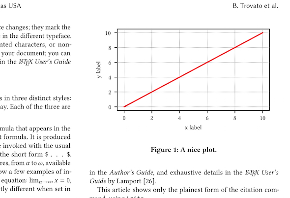

=======
pubplot
=======

.. image:: https://travis-ci.com/hugombarreto/pubplot.svg?token=WbvxSoxYCEXuq2yHcffB&branch=master
    :target: https://travis-ci.com/hugombarreto/pubplot

**pubplot** makes easy to create publication quality plots that fit elegantly
in your LaTeX document.

Usage
-----

Start creating a document matching your LaTeX documentclass:

>>> from pubplot import Document
>>> from pubplot.document_classes import acm_sigconf
>>> doc = Document(acm_sigconf)

Now you can use your newly created ``doc`` to make plots that fit well in an
`ACM conference paper <http://www.acm.org/publications/proceedings-template>`_.

>>> fig, ax = doc.figure()
>>> ax.plot(range(11), range(11))
>>> fig.save('plot_name')

This will create two files ``plot_name.pdf`` and ``plot_name.pgf``.

If you are familiar with matplotlib you will have no problem using pubplot.

 \usepackage{pgf}

Installing
----------

Ubuntu/Debian
.............

Make sure you have an updated LaTeX installation::

    sudo apt update
    sudo apt install texlive-base texlive-latex-recommended texlive-fonts-recommended texlive-publishers texlive-latex-extra

Now install ``pubplot`` using ``pip``::

    pip install pubplot

macOS
.....

You need a basic LaTeX installation. An easy way of getting LaTeX on a mac is
through `homebrew cask <https://caskroom.github.io>`_ (although any other form
of getting mactex should be fine)::

    brew cask install mactex

Now install ``pubplot`` using ``pip``::

    pip install pubplot

**Optional but recommended.** Matplotlib works better if you install some
dependencies, if you use `homebrew <https://brew.sh>`_ that can be accomplished
with::

    brew install libpng freetype pkg-config fontconfig

